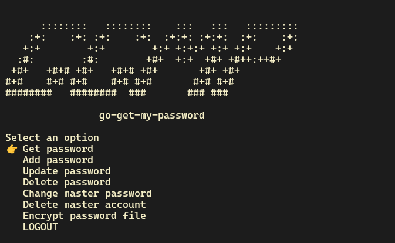

# Go-Get-My-Password

=======================

A simple password manager that runs on the terminal with basic menu UI features -- built with Go and Bubble Tea.

## Overview

---

This password manager allows users to store, retrieve, and manage their passwords in a secure and convenient way. The CLI provides a menu-driven interface for users to interact with the password manager.

## Features

---

- Store passwords securely using AES encryption
- Retrieve passwords by domain name/URI
- Add, edit, and delete password entries
- Generate strong, unique passwords

## Usage

---

1. Run the CLI using `go run main.go`
2. Follow the menu prompts to perform desired actions

## Dependencies

This project requires the following dependencies:

- Go 1.23.1 or later
- github.com/mattn/go-sqlite3
- golang.org/x/crypto/argon2
- golang.org/x/crypto/bcrypt
- github.com/charmbracelet/bubbletea
- github.com/charmbracelet/bubbles
- modernc.org/sqlite

To install these dependencies, run:

```bash
go get github.com/mattn/go-sqlite3
go get golang.org/x/crypto/argon2
go get golang.org/x/crypto/bcrypt
go get github.com/charmbracelet/bubbletea
go get github.com/charmbracelet/bubbles
go get modernc.org/sqlite
```

## Security

---

- Passwords are stored securely using AES encryption.
- AES encryption is used with GCM (Galois/Counter Mode) for ensuring data integrity and confidentiality.
- A unique salt is generated for each password, and Argon2 is used for key derivation to protect against brute-force attacks.
- Users are prompted to enter a master password to access the password manager.
- The master password is used to derive an encryption key using Argon2, ensuring that the key is unique and secure.
- The application allows users to encrypt the file that stores all the encrypted passwords. To run the application and decrypt the file, users need to use the -file flag to pass the path to the encrypted file and the -key flag to pass the password to decrypt the file.

### Example

```
./ggmp -file=./home/myggmpdbfile.db -key=abc123
```

## Demo

Here's a step-by-step demo of how to use Go-Get-My-Password:

### Creating master password


### Unlock screen (after you've set master password)


### Post login screen



### Adding a new psasword


### Listing saved logins


### Viewing passwords


### Generating password


### Encrypting the database file


## Contributing

---

Contributions are welcome! Please submit a pull request with your changes and a brief description of what you've added or fixed.

## License

---
